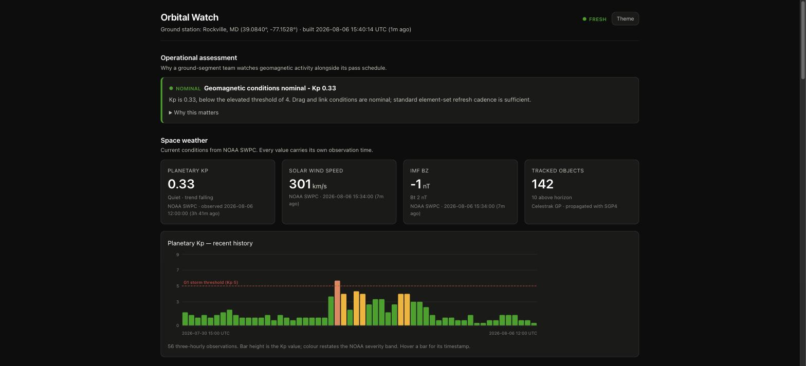
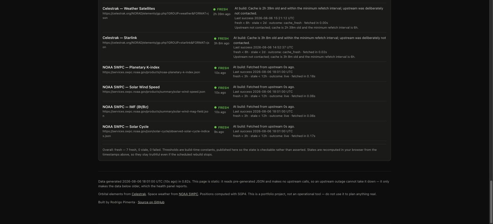

# Orbital Watch

A public dashboard that tracks which satellites are passing over a ground
station and correlates those passes with live space-weather conditions.

**Live site:** **[orbital.rodrigopimenta.com](https://orbital.rodrigopimenta.com)**



The system health panel, which is the part worth looking at closely — every
source reports its state, its last success, the thresholds that define that
state, and how long the fetch took:



---

## Why it exists

Ground-segment teams care about two things that look unrelated and are not.

The first is **when a spacecraft is reachable**. Passes over a station are
short — a low-Earth-orbit satellite is above a 10° mask for roughly five to
twelve minutes — and everything else in the schedule bends around them.

The second is **geomagnetic activity**, and it is not a curiosity. Energy
deposited into the upper atmosphere during a geomagnetic storm heats and
expands the thermosphere, raising neutral density at LEO altitudes. Higher
density means more drag: satellites lose altitude faster, along-track position
error grows between element-set updates, and published TLEs go stale sooner
than usual. The same disturbance degrades the links used to talk to those
spacecraft — HF propagation becomes unreliable at high latitudes, and
ionospheric scintillation can disrupt UHF and L-band, including GPS.

So when Kp climbs, a tracking schedule computed from yesterday's elements gets
quietly less accurate at the same moment the links get less reliable. This
dashboard puts both on one screen and states the operational consequence
explicitly rather than leaving the reader to connect them.

It is a portfolio project, not an operational tool.

---

## Architecture

```
   ┌─────────────────┐        ┌──────────────────┐
   │  Celestrak GP   │        │    NOAA SWPC     │      upstream, public,
   │  (TLE/OMM)      │        │  (Kp, wind, IMF) │      unauthenticated
   └────────┬────────┘        └────────┬─────────┘
            │                          │
            └──────────┬───────────────┘
                       ▼
         ┌──────────────────────────────┐
         │  Cloudflare Pages build      │  hourly, via
         │  fetch → propagate → health  │  a deploy hook
         │  → write JSON (seed backstop)│
         └──────────────┬───────────────┘
                        ▼
         ┌──────────────────────────────┐
         │  static JSON + HTML/CSS/JS   │   dist/
         └──────────────┬───────────────┘
                        ▼
               Cloudflare Pages
                        │
                        ▼
                    browser          ← never calls an upstream API
```

A Python build job fetches upstream data, computes positions and passes,
evaluates the health of every source, and writes five JSON files into the build
output. The frontend loads those files and renders. **The browser never
contacts Celestrak or NOAA.**

That indirection is the point, and it buys three things:

1. **An upstream outage cannot take the site down.** If Celestrak is
   unreachable at 03:00, the run falls back to cached element sets — or, on a
   cold build container, to the committed seed snapshot — the site still
   renders every panel, and the health panel says the data is stale and why.
   Compare a live-proxy design, where the same outage puts a spinner or a
   stack trace in front of whoever is looking.
2. **Hosting costs nothing and cannot fall over.** Static files on a CDN. No
   server, no serverless function, no database, no secrets.
3. **"Last updated" becomes a real claim.** Because every fetch is recorded
   with its outcome and timestamp, the freshness shown on the page is measured
   rather than asserted.

---

## Reliability behaviour

This is the part worth reading closely, because it is the part the project is
actually about.

### Every network call goes through one function

There is exactly one place in the codebase that performs network I/O:
`fetch_json()` in `src/orbital_watch/sources/fetch.py`. It guarantees four
things for every caller:

- a hard timeout — no unbounded waits;
- failure is caught, logged with source and elapsed time, and falls back to the
  on-disk cache;
- the outcome is recorded in a result object the health panel reports verbatim;
- **it never raises.** No caller can abort the build by forgetting a
  `try`/`except`, because there is nothing to catch.

A single choke point rather than scattered `try`/`except` blocks means the
question "what happens when upstream is down?" has exactly one answer, and that
answer is testable in isolation.

### What each failure actually does

| Situation | Outcome | Site behaviour | Health panel |
|---|---|---|---|
| Fetch succeeds | `live` | Fresh data | **fresh** |
| Cache younger than the refetch floor | `cache_fresh` | Cached data | **fresh** — upstream deliberately not contacted |
| Upstream says nothing changed | `not_modified` | Cached data | **fresh** |
| Upstream down, cache warm | `cache_fallback` | Cached data still renders | **stale** — with the connection error |
| Upstream down, no cache, seed present | `seed` | Committed snapshot renders | **stale** — never *fresh*, whatever its age |
| Upstream down, no cache, no seed | `failed` | That panel empties, others unaffected | **failed** — with the reason |
| Data older than the staleness limit | — | Data still renders | **failed** — "not operationally current" |
| Malformed / non-JSON response | `cache_fallback` | Cached data | **stale** — cache is *not* overwritten |

Two behaviours worth calling out:

**A source can be serving good numbers and still not be "fresh."** If upstream
was unreachable this run but the cache is 30 minutes old, the data on screen is
fine — and the panel reports **stale** anyway, because we have lost contact and
saying "fresh" would be a lie. Reporting freshness honestly is the entire
purpose of the panel.

**A bad response never poisons the cache.** A malformed or non-JSON reply is
rejected at the boundary, so the good cached copy you would fall back to
survives. There is a test for exactly this.

### Degradation is proven, not asserted

`tests/test_sources.py` exercises this at two levels. At the fetch layer it
breaks a source under four failure modes (timeout, DNS failure, HTTP 500,
HTTP 403), with and without a warm cache. At the build level it breaks each
of the seven sources in turn under timeout and HTTP 500, then breaks all
seven at once, and asserts every time that the build completes and writes a
complete, parseable site. The full-blackout test additionally asserts that
the health block reports everything failed rather than pretending otherwise.
A further set feeds deliberately wrong-shaped payloads — a dict where a list
belongs, a list of scalars, a bare string — from both upstream and a stale
cache, because a cache written by older code is routinely read by newer code.

You can watch it happen for real:

```bash
# Build with all sockets blocked and a cold cache.
uv run python - <<'PY'
import socket
def dead(*a, **k): raise OSError(101, "Network is unreachable")
socket.socket.connect = dead; socket.create_connection = dead; socket.getaddrinfo = dead
from orbital_watch.build import main
raise SystemExit(main(["--build-dir", "dist-offline", "--cache-dir", ".cache-offline"]))
PY
```

This exits 0, writes all five JSON files, and reports 7/7 sources failed. The
same check runs in CI on every push.

---

## Local setup

Requires [uv](https://docs.astral.sh/uv/) and Python 3.11+.

```bash
git clone https://github.com/rodrigopimenta10/orbital-watch.git
cd orbital-watch

# Install dependencies (creates .venv automatically)
uv sync --dev

# Fetch upstream data and build the site into dist/
uv run python -m orbital_watch.build

# Serve it -- the page fetches JSON, so file:// will not work
python3 -m http.server 8000 --directory dist
# then open http://localhost:8000
```

Useful flags:

```bash
uv run python -m orbital_watch.build --verbose          # debug logging
uv run python -m orbital_watch.build --build-dir out    # different output dir
uv run python -m orbital_watch.build --cache-dir /tmp/c # different cache
```

Point it at a different ground station without touching code:

```bash
ORBITAL_WATCH_SITE_NAME="Svalbard" \
ORBITAL_WATCH_LAT=78.2297 \
ORBITAL_WATCH_LON=15.4075 \
  uv run python -m orbital_watch.build
```

---

## Tests

```bash
uv run pytest              # 116 tests
uv run ruff check .        # lint
uv run ruff format --check .
```

**No test makes a network call.** That is enforced mechanically, not by
convention: an autouse fixture in `tests/conftest.py` replaces
`urllib.request.urlopen` with a function that raises, so a live call fails
loudly instead of passing on one machine and flaking in CI. Everything runs
from real API responses captured into `tests/fixtures/`.

Three groups are worth knowing about:

**Propagation correctness** (`test_propagate.py`) checks against the published
SGP4 verification vectors from Vallado et al., *Revisiting Spacetrack Report #3*
(AIAA 2006-6753) — an independently-known result, not a number this project
generated and then froze. Backed by physical checks that nothing in the code
knows the answer to: GOES spacecraft must come out at geostationary altitude
(~35,786 km), the ISS at a plausible LEO altitude with a ~93-minute period.

**Health boundaries** (`test_health.py`) pin every freshness threshold
including the exact-equality cases, where off-by-one errors live.

**Graceful degradation** (`test_sources.py`) is the most important test in the
project. It proves the claim the whole architecture rests on: that no upstream
failure — individually or all at once, cold cache or warm — can prevent the
build from producing a complete site that tells the truth about its own state.

---

## Data sources

| Source | Endpoint | Fetched |
|---|---|---|
| [Celestrak](https://celestrak.org/) | GP API, groups `stations`, `weather`, `starlink` | at most every 6 h |
| [NOAA SWPC](https://www.swpc.noaa.gov/) | planetary K-index | hourly |
| NOAA SWPC | solar wind speed, IMF Bt/Bz | hourly |
| NOAA SWPC | observed solar cycle indices | hourly |

All public, unauthenticated, no API keys. **The project requires no secrets and
no `.env` file of any kind.**

Celestrak rate-limits aggressively and blocks abusive clients, so:

- responses are cached to disk and reused;
- the fetcher **refuses** to re-request a group whose cache is younger than six
  hours, enforced in code rather than by the cron schedule — so the limit holds
  even under manual runs or a misconfigured trigger;
- requests carry a descriptive `User-Agent` identifying the project;
- only the three named groups are fetched, never the full catalogue.

Starlink is sampled (60 of ~10,900 objects, most recent epochs) — see
[DECISIONS.md](DECISIONS.md).

Two upstream findings, both documented in [DECISIONS.md](DECISIONS.md): the
`products/solar-wind/plasma-*.json` endpoints in the original spec now return
404 and were replaced with SWPC's summary endpoints; and Celestrak signals
"nothing has changed" with an **HTTP 403 whose body is a plain sentence**,
which needs handling on the error path or a benign no-op gets reported as a
hard failure.

---

## Deployment

Hosted on **Cloudflare Pages** at
[orbital.rodrigopimenta.com](https://orbital.rodrigopimenta.com), built
directly from this repository. The domain is registered through Cloudflare
Registrar with its DNS on the same account, which keeps the custom-domain
step to a confirmation rather than a DNS edit. There are no secrets in the
repo and none are needed to build it.

### 1. Connect the repository

In the Cloudflare dashboard: **Workers & Pages → Create → Pages → Connect to
Git**, pick this repository, then set:

| Setting | Value |
|---|---|
| Framework preset | **None** |
| Build command | `pip install uv && uv sync --frozen && uv run python -m orbital_watch.build` |
| Build output directory | `dist` |
| Root directory | *(leave blank)* |
| Production branch | `main` |

No environment variables are required. `PYTHON_VERSION` is not needed either —
the committed `.python-version` pins the interpreter, and Cloudflare's build
image reads it.

`wrangler.toml` declares `pages_build_output_dir = "dist"`. Once that file
exists Cloudflare treats it as the source of truth for the output directory,
so the dashboard field for it becomes read-only. That is deliberate: the
deploy configuration is reviewed in pull requests instead of being clicked
into a web form and forgotten. The build *command* has no wrangler equivalent
and stays in the dashboard.

### 2. Point the custom domain at it

**Pages project → Custom domains → Set up a domain →**
`orbital.rodrigopimenta.com` → **Continue** → confirm the record.

`rodrigopimenta.com` is registered through Cloudflare and its zone is on the
same account, so there is no DNS record to add by hand: Cloudflare creates the
proxied `CNAME orbital → <project>.pages.dev` for you once you confirm. Because
this is a subdomain rather than an apex, no nameserver change is involved
either. TLS is provisioned automatically — nothing to configure, no
certificate to renew.

The equivalent record, if the zone ever moves to another DNS provider:

```
Type    Name       Target
CNAME   orbital    <project>.pages.dev
```

### 3. Add the scheduled refresh

Cloudflare rebuilds on every push, but the data needs refreshing on a schedule
too. That is a **Cloudflare Worker Cron Trigger** in `infra/refresh-worker/`,
which POSTs a Pages **deploy hook** every two hours.

1. **Pages project → Settings → Builds & deployments → Deploy hooks →** create
   one for `main`. Cloudflare gives you a URL.
2. Deploy the Worker and give it that URL as a secret:

   ```bash
   cd infra/refresh-worker
   npx wrangler secret put DEPLOY_HOOK     # paste the deploy hook URL
   npx wrangler secret put GITHUB_TOKEN    # optional, see below
   npx wrangler deploy
   ```

The hook URL is a capability — anyone holding it can trigger a build — so it
lives only as a Worker secret, never in the repository.

**Why the scheduler is on Cloudflare rather than GitHub Actions.** It used to
be an Actions cron. On 2026-08-06 Actions went into a major outage, the site's
data went stale for more than three hours, and the staleness banner fired —
while Cloudflare, which actually serves the site, was healthy throughout. Only
the scheduler was down, and it took the freshness story with it. Worse, that
workflow had never fired once in its entire life: `gh run list` showed zero
runs. Host and scheduler now live on the same platform, so a refresh can only
stop for a reason that would have taken the site down anyway. See
[DECISIONS.md](DECISIONS.md) §14.

**The Worker also watches the watchman.** After triggering, it reads the
deployed `/data/health.json` and compares `generated_at` to now. Because the
build it just started cannot have finished, that timestamp describes the
*previous* cycle — which is exactly the question worth asking: did the last
refresh actually publish? If the data is older than three times the cadence it
reports loudly, opening a GitHub issue when `GITHUB_TOKEN` is set and logging
at error level regardless. Without that check the only signal that refreshes
had stopped was a visitor noticing the banner, which is how the original
outage was found.

`ci.yml` stays on GitHub Actions. Tests and linting belong with the code host;
it is only the production refresh path that must not depend on it.

### Why the build fetches its own data

Cloudflare build containers are ephemeral, so unlike a CI runner there is no
`.cache/` carried between builds — every build starts cold. A cold build
during an upstream outage would publish an empty dashboard, which is exactly
the failure this project exists to avoid.

`seed/` is the answer: a small committed snapshot used only when there is no
cache **and** upstream is unreachable. It is honest by construction rather
than by disclaimer — `seed/manifest.json` records each snapshot's real capture
time, that timestamp is what the health panel classifies, and a seed never
reports **fresh** no matter how recent it is, because it is served precisely
when we reached nobody. So a seeded build shows real satellites while stating
plainly that the data is not live.

### Workflows

- **`ci.yml`** — `ruff check`, `ruff format --check`, and `pytest` on a
  3.11/3.12 matrix for every push and PR, plus a step that builds with all
  sockets blocked and asserts the result is a complete site reporting total
  upstream failure. Actions are pinned to commit SHAs rather than tags, since
  a tag can be re-pointed at other code.
- **`update-data.yml`** — hourly deploy-hook trigger, plus
  `workflow_dispatch`. `concurrency: cancel-in-progress: false`, so two
  overlapping runs can never produce a half-published site.

### Deploying from the command line instead

The Git integration above is the intended path. For a one-off manual deploy:

```bash
uv run python -m orbital_watch.build
npx wrangler pages deploy dist --project-name orbital-watch
```

That needs `CLOUDFLARE_API_TOKEN` and `CLOUDFLARE_ACCOUNT_ID` in your
environment. Do not commit them.

---

## What is intentionally not built

Scope discipline is part of the design, so these are omissions, not gaps:

- **No user accounts, no database, no notifications.** All three would require
  a backend, which would forfeit the property that makes this thing reliable.
- **No full satellite catalogue browser.** Celestrak already is one, and doing
  it properly means search, pagination, and a much larger payload.
- **No 3D globe.** It would be the most eye-catching thing here and would tell
  an operator nothing that the elevation, azimuth, and range columns do not
  already say more precisely.
- **No mobile app.** The page is responsive; a native app would add
  distribution overhead for zero functional gain.
- **No live API proxy or serverless function.** Deliberate. It would
  reintroduce exactly the runtime upstream dependency the architecture exists
  to remove.
- **No illumination or eclipse modelling.** It needs a JPL ephemeris kernel —
  a ~16 MB download and another build-time network dependency — for a feature
  outside the brief.

---

## Layout

```
src/orbital_watch/
├── config.py            observer, tracked groups, thresholds — all constants
├── sources/
│   ├── fetch.py         the only network I/O: timeout, cache, status
│   ├── celestrak.py     GP element sets, rate-limit-aware
│   └── swpc.py          space weather + Kp interpretation
├── propagate.py         SGP4 → positions and passes
├── health.py            freshness state machine
└── build.py             entry point: writes dist/data/*.json
web/                     static frontend, copied verbatim into dist/
  _headers               Cloudflare Pages response headers (CSP, caching)
seed/                    last-resort snapshot for builds with no cache
tests/fixtures/          real API responses, committed
wrangler.toml            Cloudflare Pages build output directory
```

Design decisions and their rationale are in [DECISIONS.md](DECISIONS.md).
